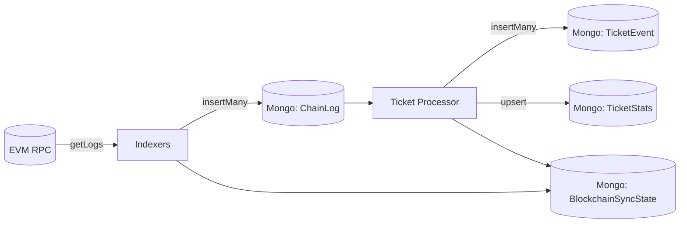

# Blockchain Indexer & Processor (Backend)

Tài liệu này mô tả **chi tiết** pipeline đồng bộ dữ liệu blockchain trong backend:

- **Indexer**: lấy log từ RPC (EVM) và lưu thô vào MongoDB (`ChainLog`).
- **Processor**: đọc `ChainLog` và materialize dữ liệu “dễ query” (`TicketEvent`, `TicketStats`).

Mục tiêu thiết kế:

- **Idempotent** (chạy lại không tạo dữ liệu sai).
- **Reorg-safe** (xử lý tổ chức lại chain bằng cách rescan một cửa sổ block).
- **Có checkpoint** (lưu tiến độ ở `BlockchainSyncState`).

## 1) Tổng quan luồng dữ liệu



### Indexer là gì?

Indexer là các job chạy nền theo vòng lặp, mỗi vòng:

1. Xác định block mục tiêu `targetBlock = latestBlock - confirmations`.
2. Tính `fromBlock` theo reorg buffer.
3. Chạy theo chunk: `deleteMany(ChainLog, range)` → `provider.getLogs(range)` → `insertMany(ChainLog)`.
4. Cập nhật checkpoint: `BlockchainSyncState.lastProcessedBlock = currentTo`.

### Processor là gì?

Processor là job chạy nền đọc `ChainLog` đã được index:

1. Rescan theo cửa sổ reorg (giống indexer) nhưng thay vì RPC, nó query từ Mongo.
2. Xóa các bản ghi derived trong range rồi re-insert.
3. Rebuild thống kê theo `eventId`.
4. Cập nhật checkpoint riêng.

## 2) Data model (MongoDB)

### 2.1. `ChainLog` (raw logs)

File: `backend/src/models/ChainLog.js`

Các field chính:

- `contractName`, `contractAddress`
- `blockNumber`, `blockHash`
- `transactionHash`, `transactionIndex`, `logIndex`
- `eventName`, `args` (parse từ ABI nếu parse được)

Index quan trọng:

- Unique: `(contractAddress, transactionHash, logIndex)` để idempotent.
- Range query: `(contractAddress, blockNumber)` để cleanup nhanh.

### 2.2. `TicketEvent` (derived, query-friendly)

File: `backend/src/models/TicketEvent.js`

Mục tiêu: chuẩn hóa các event quan trọng của Ticket để query nhanh, không phải decode/duyệt `args` mỗi lần.

Một số event được map:

- `TicketMintedBatch`
- `TicketPurchased`
- `TicketUsed`
- `TicketExpired`
- `TicketRefunded`
- `Transfer` (ERC721)
- `FundContractSet`

Unique key vẫn là `(contractAddress, transactionHash, logIndex)` để idempotent.

### 2.3. `TicketStats` (materialized stats)

File: `backend/src/models/TicketStats.js`

Mỗi document ứng với `(contractAddress, eventId)`:

- `totalMinted`, `totalSold`, `totalUsed`, `totalExpired`, `totalRefunded`
- `totalRevenueWei` (string)

Do `wei` có thể vượt giới hạn số an toàn của JS, revenue lưu dạng string.

## 3) Reorg handling (chiến lược chống reorg)

Trong EVM, chain có thể reorg vài block gần tip. Để tránh dữ liệu “kẹt” theo chain cũ:

- Mỗi vòng lặp đều **rewind** `REORG_BUFFER_BLOCKS` (mặc định 12) từ `lastProcessedBlock`.
- Với mỗi chunk trong cửa sổ rescan:
  - Indexer: xóa `ChainLog` trong `[fromBlock..toBlock]` rồi fetch lại từ RPC.
  - Processor: xóa `TicketEvent` trong `[fromBlock..toBlock]` rồi build lại từ `ChainLog`.

Helper chung nằm ở `backend/src/services/blockchain/sync/reorgPolicy.js`.

## 4) Checkpointing (`BlockchainSyncState`)

File: `backend/src/models/BlockchainSyncState.js`

Mỗi job sẽ có `contractName` riêng:

- Indexer Ticket: `Ticket`
- Indexer Fund: `Fund`
- Indexer Marketplace: `Marketplace`
- Ticket Processor: `TicketProcessor`

`lastProcessedBlock` là block đã xử lý tới (inclusive). Mỗi vòng sau sẽ rewind lại một khoảng theo `REORG_BUFFER_BLOCKS`.

## 5) Cấu hình qua env

Các biến chung (dùng cho mọi indexer/processor):

| Env | Mặc định | Ý nghĩa |
|---|---:|---|
| `RPC_URL` | (bắt buộc) | RPC endpoint EVM |
| `CHAIN_CONFIRMATIONS` | `12` | Chỉ xử lý tới `latest - confirmations` |
| `REORG_BUFFER_BLOCKS` | `12` | Rewind để rescan chống reorg |
| `CHAIN_LOG_CHUNK_SIZE` | `2000` | Chunk size khi chạy theo range |
| `CHAIN_SYNC_INTERVAL_MS` | `10000` | Delay giữa các vòng indexer |
| `CHAIN_PROCESS_INTERVAL_MS` | `CHAIN_SYNC_INTERVAL_MS` | Delay giữa các vòng processor |

Biến start block:

| Env | Mặc định | Dùng cho |
|---|---:|---|
| `TICKET_START_BLOCK` | `0` | Ticket indexer |
| `FUND_START_BLOCK` | `0` | Fund indexer |
| `MARKETPLACE_START_BLOCK` | `0` | Marketplace indexer |
| `TICKET_PROCESSOR_START_BLOCK` | `TICKET_START_BLOCK` | Ticket processor |

## 6) Cách chạy (CLI)

Điều kiện:

- MongoDB chạy và backend có thể connect.
- `backend/.env` đã có `RPC_URL` và địa chỉ contract (`TICKET_ADDRESS`, `FUND_ADDRESS`, `MARKETPLACE_ADDRESS`).

### 6.1. Chạy từng indexer

Trong thư mục root repo:

```bash
npm run backend indexer:ticket
npm run backend indexer:fund
npm run backend indexer:marketplace
```

Hoặc chạy trực tiếp file runner trong backend:

```bash
cd backend
node src/services/blockchain/indexers/ticket/run.js
node src/services/blockchain/indexers/fund/run.js
node src/services/blockchain/indexers/marketplace/run.js
```

### 6.2. Chạy ticket processor

Processor yêu cầu `ChainLog` đã được index (ít nhất là Ticket indexer).

```bash
npm run backend processor:ticket
```

Hoặc:

```bash
cd backend
node src/services/blockchain/processors/ticket/run.js
```

## 7) Gợi ý vận hành

- Trong dev/local chain, có thể set `CHAIN_CONFIRMATIONS=0` để index tới tip nhanh hơn (chấp nhận rủi ro reorg khi chạy mạng public).
- Nếu DB đã bị sai do test nhiều lần, có thể xoá collections derived (`TicketEvent`, `TicketStats`) rồi chạy processor lại (processor sẽ rebuild).
- Indexer/processor được thiết kế để chạy lặp lâu dài; lỗi tạm thời sẽ được ghi vào `BlockchainSyncState.status=error` và vòng sau có thể tự hồi phục.
